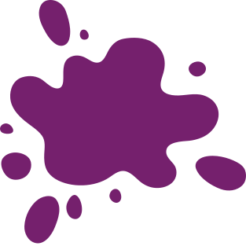

[REACT_BAGDE]: https://img.shields.io/badge/React-20232A?style=for-the-badge&logo=react&logoColor=61DAFB
[TS_BADGE]: https://img.shields.io/badge/TypeScript-007ACC?style=for-the-badge&logo=typescript&logoColor=white

<h1 align="center" style="font-weight: bold;">[ARTBUY]</h1>

![react][REACT_BAGDE]
![typescript][TS_BADGE]

  

<h2 id="started">📌 About</h2>
API built on React, made for managing users, works of art, financial transactions and auctions, providing a safe and reliable experience for buyers and sellers.

<h2 id="started">🚀 Getting started</h2>
Here you describe how to run your project locally

<h3>Prerequisites</h3>
Here you list all prerequisites necessary for running your project. For example:

- [Node](https://nodejs.org/en/download/package-manager) (used: v20.12.2)
- [Yarn](https://classic.yarnpkg.com/lang/en/docs/install/#debian-stable) (used: 1.22.19)

<h3>Running</h3>
- Create [.env] referring to [.env.example] and change the values

- Install Dependencies: `yarn` | `npm i`

- Run Project: `yarn dev` | `npm run dev`
